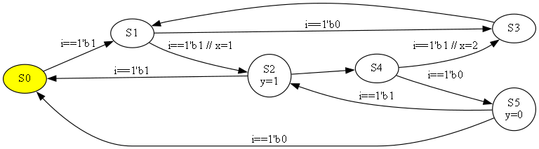

# FsmLog
Sources are Yaml format.

```
inputs : 
# width
    i : 1


outputs : 
# width,  trig/hold/wire
    y : [1,  hold]


vars :  # internal
# width,  t/h
    x : [8,  trig]
    f : [1,  wire, ~x]


fsm : 
    S0 : {S1 : i==1'b1}

    S1 : 
        S2 :
            + : i==1'b1
            x : 1

        S3 : i==1'b0

    S2 : 
        S0 : i==1'b1
        S4 : ''   # Unconditional jump
        y  : 1

    S3 :  S1

    S4 : 
        S5 : i==1'b0
        S3 : 
            # Order is priority, and Unconditional must be at the end
            x : 2

    S5 : 
        S0 : i==1'b0
        S2 : i==1'b1
        y  : 0
```

To generate Verilog-HDL & dot-Graph from a source file.
```
$ python fsmlog.py example/test.yaml
```

To view [dot-Graph](http://www.graphviz.org/)
```
$ dot -Tpng test.gv -o test.png
```


