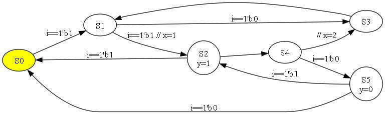

# FsmLog
Sources are Yaml format.

```
input :
# width
    i : 1


output :
# width,  trig/hold/wire
    y : [1,  hold]


var :  # internal
# width,  trig/hold/wire
    x : [8,  trig]
    f : [1,  wire, ~x]


fsm :
    S0 : {S1 : i==1'b1}

    S1 :
        S2 :
            + : i==1'b1   # Jump condition
            x : 1         # Jump assignment

        S3 : i==1'b0      # Jump condition

    S2 :
        S0 : i==1'b1
        S4 : +      # Unconditional jump
        y  : 1      # State assignment

    S3 :  S1        # Unconditional jump

    S4 :
        S5 : i==1'b0
        S3 :
            # Order is priority, and Unconditional must be at the end
            x : 2   # Jump assignment

    S5 :
        S0 : i==1'b0
        S2 : i==1'b1
        y  : 0      # State assignment
```

To generate Verilog-HDL & dot-Graph from a source file.
```
$ python fsmlog.py example/test.yaml
```

To view [dot-Graph](http://www.graphviz.org/)
```
$ dot -Tpng test.gv -o test.png
```



# Prerequisites
- Python3 and pip3
```
pip3 install pyyaml
pip3 install graphviz
```

- Graphviz binaries
